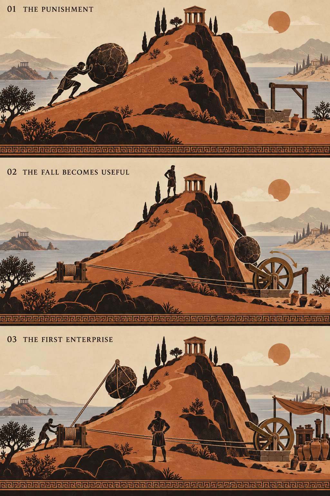

# First hill visual progression — concept v1

Status: proposed art direction for review, not an approved production asset or gameplay screenshot.
Generated with the built-in image generation tool on 2026-09-27.
Authority: ../specification.md remains authoritative for gameplay and timing.

## Visual story

1. **The punishment.** Sisyphus leans into the stone. The hill dominates the frame, with sparse objects at the impact area. The player should understand effort and repetition from the pose alone.
2. **The fall becomes useful.** The first descent after purchase turns the capture mechanism, flywheel and connected rope drum. Sisyphus still supplies uphill effort. The wheel assists subsequent ascents; it does not automate the site.
3. **The first enterprise.** A shade supplies continuous effort at the capstan. Sisyphus steps aside while the same stone keeps cycling. The small awning and ordered amphorae express growth without filling the world with equipment.

These are three visual states, not the project's numbered development stages. Development stage 1 needs the first state; flywheel and foreman belong to development stage 2.

## Keep from this concept

- Restrained ink, clay and parchment palette, adult proportions and incised figure details.
- The same recognizable hill across purchases.
- A visible relationship between the descent, wheel and uphill assistance.
- Sisyphus's relief as the major automation reward.
- Small installations that preserve the prominence of the landscape.

## Corrections before production

- In panel 3, the boulder appears suspended. Keep it in contact with the uphill path; the cradle pulls along the ramp, never lifts it through the air.
- Make the return route from impact basin to uphill start explicit. This concept does not resolve that connection.
- Design mechanically readable rope guides, capture paddle and drive linkage. The generated connections are illustrative, not construction references.
- Lock identical scene anchors and character scale across all states. Panel 2's summit figure is too large relative to the temple.
- Reduce distant scenery, vegetation and texture where they compete with moving silhouettes at phone scale.
- Give the shade a distinct silhouette so it cannot be confused with another Sisyphus.
- The summit temple and workshop dressing are optional concept additions, not new gameplay systems.

## Motion handoff

| Beat | Visual cue | Gameplay constraint |
| --- | --- | --- |
| Push | Forward lean, planted feet, slow rolling markings | Releasing effort pauses ascent without losing progress |
| Summit | Brief anticipation, weight shifts away | Preserve phase timing and automatic summit payout |
| Descent | Accelerating visual roll down the fixed chute | Four-second descent; no player timing challenge |
| Impact | Compact chips and a short compression/rebound | Impact payout occurs at the scheduled boundary |
| Return | Clear route back to the start | One-second return; one boulder |
| First wheel charge | Capture paddle engages, wheel turns, belt follows | Assistance begins after the first completed descent following purchase |
| Foreman purchase | Shade takes the drum, Sisyphus steps aside | Continuous production communicates automation |
| Reduced motion | Essential poses and machine-state changes | Remove decorative bursts and camera motion without changing rewards |

## Asset separation

Prepare separate layers for background, hill and paths, foreground, Sisyphus rig, boulder, shade rig, flywheel, capture paddle, belt, rope drum and optional workshop dressing. Keep economic values and controls in the DOM. This flattened concept is a reference, not a sprite sheet.

## Review questions

- Does this pottery treatment feel right for the game?
- Is the hill suitably spare, or should the scenery be simplified further?
- Can players distinguish assistance from automation without explanation?

## Generation record

The exact generation prompt is in first-hill-progression-v1-prompt.md.

